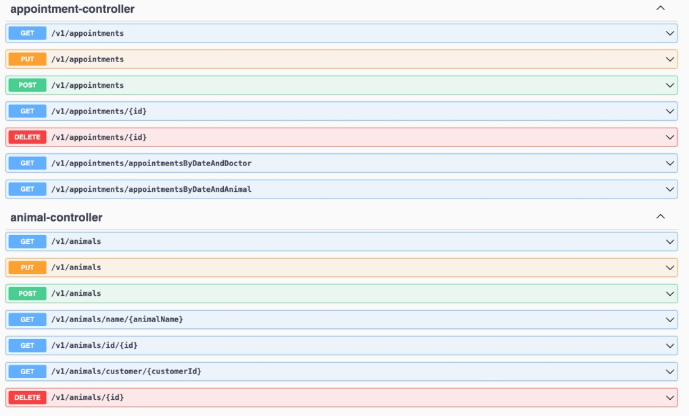

# Veterinary Management System

## Description
The Veterinary Management System project is designed to enable a veterinary clinic to manage its operations efficiently through an API. This application will be used by veterinary staff to:

- Register veterinary doctors
- Record doctors' available dates (without time)
- Register customers
- Register animals belonging to customers
- Record vaccinations applied to animals with dates
- Schedule appointments for animals with veterinary doctors

## Table of Contents

- [Description](#description)
- [Technologies](#technologies)
- [Project Overview](#project-overview)
- [Features](#features)
- [Installation](#installation)
    - [Clone](#clone)
    - [Database Setup](#database-setup)
- [Database Design](#database-design)
- [Coding Practices](#coding-practices)
- [API Documentation](#api-documentation)
- [Screenshots](#screenshots)
- [UML Diagram](#uml-diagram)

## Technologies

- Java 21
- Spring Boot
- Spring Data JPA
- PostgreSQL / MySQL
- Swagger
- IntelliJ IDEA

## Project Overview

The project consists of several key components:

- **Animal Management**
- **Customer Management**
- **Vaccination Management**
- **Appointment Management**
- **Doctor Management**
- **Doctor Availability Management**

## Features

### Animal Management
- Add, update, view, and delete animals.
- Filter animals by name.
- List all animals for a specific customer.

### Customer Management
- Add, update, view, and delete customers.
- Filter customers by name.

### Vaccination Management
- Add, update, view, and delete vaccinations for animals.
- Prevent adding a new vaccination if the same type of vaccine is still effective.
- List all vaccinations for a specific animal.
- List animals with vaccinations expiring within a specified date range.

### Appointment Management
- Schedule, update, view, and delete appointments.
- Ensure appointments do not conflict with doctor's available dates and existing appointments.
- Filter appointments by date range and doctor or animal.

### Doctor Management
- Add, update, view, and delete veterinary doctors.

### Doctor Availability Management
- Add, update, view, and delete doctor's available dates.

## Installation

### Prerequisites

Before you begin, ensure you have the following installed on your machine:

- **Java Development Kit (JDK) 21**: [Download and Install JDK](https://www.oracle.com/java/technologies/javase-jdk21-downloads.html)
- **Maven**: [Download and Install Maven](https://maven.apache.org/install.html)
- **PostgreSQL or MySQL**: [Download PostgreSQL](https://www.postgresql.org/download/) or [Download MySQL](https://dev.mysql.com/downloads/mysql/)
- **Git**: [Download and Install Git](https://git-scm.com/book/en/v2/Getting-Started-Installing-Git)
- **IntelliJ IDEA** (or another IDE): [Download IntelliJ IDEA](https://www.jetbrains.com/idea/download/)

### Clone

1. Clone the repository: `git clone https://github.com/ahmedaliibrahim01/veterinary-management-system-api.git`
2. Navigate to the project directory: `cd veterinary-management-system-api`
3. Open the project in your IDE.

### Database Setup

1. Create a database named `veterinary_management_system` in PostgreSQL or MySQL.
2. Update the database configuration in `src/main/resources/application.properties` with your database details.
3. Import the `veterinary_management_system.sql` file to create the necessary tables and initial data.
4. Run the project.

## Database Design

The system uses a relational database with the following tables:

- `animal`: Stores animal information.
- `customer`: Stores customer information.
- `vaccine`: Stores vaccine information.
- `doctor`: Stores doctor information.
- `available_date`: Stores doctor's available dates.
- `appointment`: Stores appointment details.

## Coding Practices

- Clear and self-explanatory variable and function names.
- Maintained code readability and formatting with proper indentation.
- Provided comments and documentation for better understanding.
- Modular and reusable code.
- Used IoC and DI with constructor injection.
- Custom exceptions for handling specific errors.

## API Documentation

The API documentation is provided using Swagger. You can access the Swagger UI to explore and test the API endpoints interactively.

- **Swagger UI:** [http://localhost:8080/swagger-ui.html](http://localhost:8080/swagger-ui.html)

Swagger provides a detailed description of each endpoint, including:
- **Functionality:** What each endpoint does.
- **Input Parameters:** Required and optional parameters for the endpoint.
- **Output:** The response format, including status codes and response body.

## Screenshots

## UML Diagram
A UML diagram illustrating the system architecture and relationships between entities is included below.

## Contribution

Feel free to fork the repository and submit pull requests for new features, bug fixes, or improvements.

## License

This project is licensed under the MIT License - see the LICENSE.md file for details.
